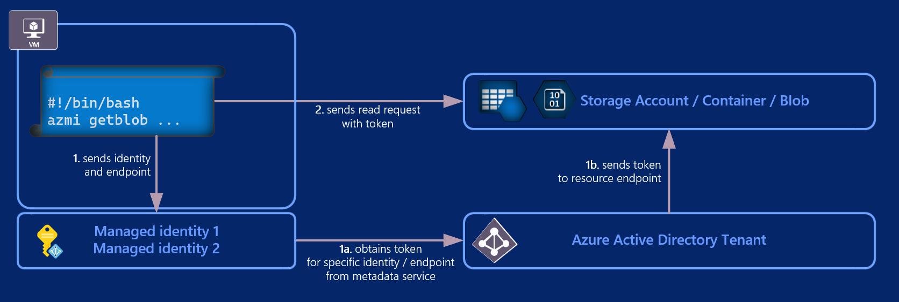

# azmi


## Description

Azure Managed Identity tool -  **azmi** - is application designed to run at Command-line interface (CLI) inside Azure Linux Virtual Machines (VM) which simplifies authentication to Azure resources. <br /><br />
Using VM with assigned Managed Identity and azmi installed you can easily authenticate against Azure services like Key Vault (download secrets to VM), Storage Account (download/upload files from VM into Azure container = become blobs), etc. You may consider azmi as Azure cloud version of [scp tool](https://linux.die.net/man/1/scp), but supporting not only file transfers, but also key vault secrets and certificates :)

## Examples

```bash
# get token from Azure infrastructure
azmi gettoken

# list all blobs in a container
azmi listblobs --container $CONTAINER_URL

# download blob from a storage account container and save to a file
azmi getblob --blob $BLOB_URL --file $FILE

# download blobs from a storage account container and save them to folder
azmi getblobs --container $CONTAINER_URL --directory ./downloadBlobsHere

# upload file by specifying blob url and identity
azmi setblob --file ~/info.txt --blob $CONTAINER_URL/myhostname/info.txt --identity 117dc05c-4d12-4ac2-b5f8-5e239dc8bc54

# upload all files from a directory to cloud container with skipping already uploaded files
azmi setblobs --directory $UPLOAD_DIR --container $CONTAINER_URL --skip-if-same

# fetch latest or specific version of a secret from Azure Key Vault
azmi getsecret --secret $SECRET_URL
azmi getsecret --secret $SECRET_URL/$VERSION

# fetch latest or specific version of a certificate(s) and private key bundle from Azure Key Vault
azmi getcertificate --certificate $CERTIFICATE_URL
azmi getcertificate --certificate $CERTIFICATE_URL/$VERSION
```

For more explanations, see detailed [commands overview](./Commands.md).

For more examples, see detailed [examples page](./Examples.md).

## Download

To download executable / package, use following commands:

- executable
```bash
wget https://azmi.blob.core.windows.net/release/azmi
chmod +x azmi
ls azmi -l
./azmi --version
```
P.S. Running azmi executable does not require root privilege.

- Debian package
```bash
wget https://azmi.blob.core.windows.net/release/azmi.deb
ls azmi.deb -l
sudo dpkg -i ./azmi.deb
azmi --version
```

- Windows

Tool `azmi` is built on top of cross-platform dotnet core.
Therefore, there are versions of `azmi` also for Windows.
Read more [here](Windows.md).

## How it works

All Azure authentication is completely transparent for VM user or for a running script.
Authentication is not attached for a user running the command, but actually to VM and its managed identity.
There is no need to keep any secrets in the code or on the system, or to rotate and distribute them.

Azmi is utilizing managed identities to authenticate against Azure AD and obtain access token.
This token is then sent to specified resource together with request for specific action (read/write data).



For other azmi commands (i.e. setblob) authentication works the same way. The only difference is with request being sent to target resource.

Azmi is not working across different AAD tenants.

Read more:
- [Managed identities for Azure resources](https://docs.microsoft.com/en-us/azure/active-directory/managed-identities-azure-resources/overview)

## Performance

Because `azmi` is written in c# / dotnet, its performance are dependant on your VM size. On Basic VM sizes, performance will be slower than native Linux commands or tools, like `curl` or `rclone`. We recommend Standard or Compute optimized VM sizes (like F2 or larger) where `azmi` performs better than `curl` tool for example.

`azmi` currently supports only serial communication (sequential). Should you need simultaneous usage consider using multiple instances of `azmi` binary.

## Common errors

By default, `azmi` will display simple, Linux style errors. To discard the error, you can redirect the error stream to null.
To get more verbose error output, use `--verbose` or `-v` switch in command.

### `Missing identity argument`

If your VM has exactly one managed identity, you can omit `--identity` parameter. If it has more than one identity, you must specify it using the same argument.

### `No managed identity endpoint found`

If you run `azmi` on non-Azure VM, you will get the error above.

### `Identity not found`

If you used `--identity` argument, please verify if you used correct client / application ID

### `Failure processing application bundle...`
Full text of an error:
`Failure processing application bundle.
Failed to create directory [/var/tmp/.net/azmi/] for extracting bundled files
A fatal error was encountered. Could not extract contents of the bundle`

You ran `azmi` as a different user in past at your host than current user. Cache for .NET bundle has been created for previous user and can not be re-used. 
Either remove cache directory (e.g. `rm -rf /var/tmp/.net/azmi`) or set specific cache directory for your current user like `export DOTNET_BUNDLE_EXTRACT_BASE_DIR="$HOME/cache_dotnet_bundle_extract"`.
For more info, see [github issue at .NET project](https://github.com/dotnet/runtime/issues/3846) which was resolved in .Net Core 3.1.4.

## Support

You can chat about **azmi** or get support for your issues via [Skype](https://www.skype.com) _(no account registration/Skype ID required)_, by clicking a link below.

[](https://join.skype.com/bSUkedMmCPwq)

Or, if you want, feel free to [open a new issue](https://github.com/SRE-PRG/azmitool/issues/new/choose).

## Pipeline statuses

| Pipeline | Status | Tests |
|---|---|---|
| Package build | [](https://skype.visualstudio.com/SCC/_build/latest?definitionId=8166) |   |
| Integration tests | [](https://dev.azure.com/iiric/azmi/_build/latest?definitionId=28) | [](https://dev.azure.com/iiric/azmi/_build/latest?definitionId=28) |
| Unit tests | [](https://dev.azure.com/iiric/azmi/_build/latest?definitionId=32) | [](https://dev.azure.com/iiric/azmi/_build/latest?definitionId=32) |
| Performance test | [](https://dev.azure.com/iiric/azmi/_build/latest?definitionId=29&branchName=master) |

See [testing overview here](./Testing.md).

## Other repository statistics


