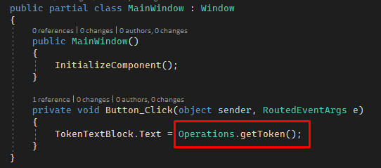
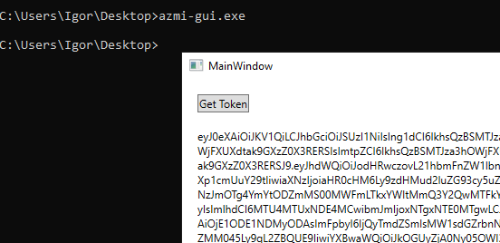

Tool `azmi` is built on top of cross-platform dotnet core.
Therefore, there are versions of `azmi` also for Windows operating system.

These versions are not actively supported, nor published regularly.

## Windows command line tool

You can download it and use it via PowerShell command prompt like this:

```PowerShell
Invoke-WebRequest https://azmi.blob.core.windows.net/release/azmi.exe -OutFile ./azmi.exe
./azmi.exe --help
./azmi.exe gettoken --verbose
```

See it in action [here](https://dev.azure.com/iiric/PS1/_build/results?buildId=1108&view=logs&j=275f1d19-1bd8-5591-b06b-07d489ea915a&t=24311d03-63ec-5098-c8e5-7df09da2b6d4).

## Windows GUI version

This one is done only for demonstration purposes.
It has only one simple call to cross-platform method for getting a new token.



```PowerShell
Invoke-WebRequest https://azmi.blob.core.windows.net/release/azmi-gui.exe -OutFile ./azmi-gui.exe
./azmi-gui.exe
```

P.S. Please note that this is self-contained version, packed in single file, with size of about 150MB.

It will give you output like this one.

